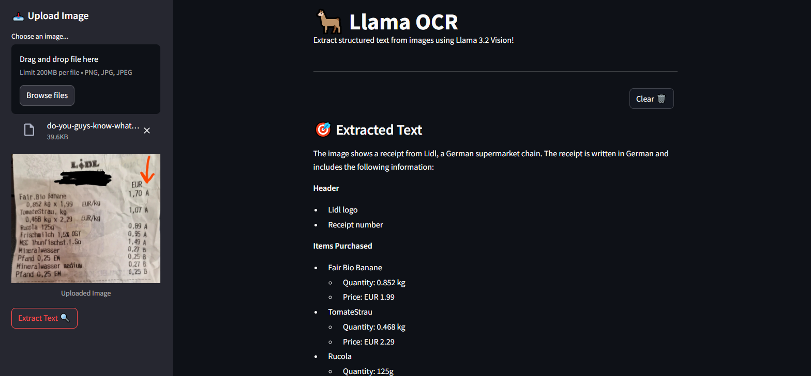

# **Llama OCR - Extract Text with Groq's Llama 3.2 Vision**

Unlock the power of **Optical Character Recognition (OCR)** using **Llama 3.2 Vision**! This intuitive web app lets you effortlessly extract structured text from images with Groq's cutting-edge AI model. Simply upload an image, and watch it transform into clear, formatted **Markdown**.

---

## **Key Features**

- **Instant Image Upload**: Supports **PNG**, **JPG**, and **JPEG** formats.
- **Smart Text Extraction**: Extracts and presents text in **Markdown** for easy reading.
- **Quick Reset**: Click **"Clear 🗑️"** to restart at any time.

---

## **How It Works**

1. **Upload an Image**: Select your **PNG/JPG/JPEG** file.
2. **Extract Text**: Hit **"Extract Text 🔍"** to process the image.
3. **View Results**: The extracted text will appear in **Markdown** format.
4. **Clear Results**: Press **"Clear 🗑️"** to reset and upload a new image.

---

## **OCR Example**

Here’s an example of how the OCR works. Upload your image, and watch the text extracted below:

---

## **License**

MIT License – Feel free to use, modify, and contribute!
